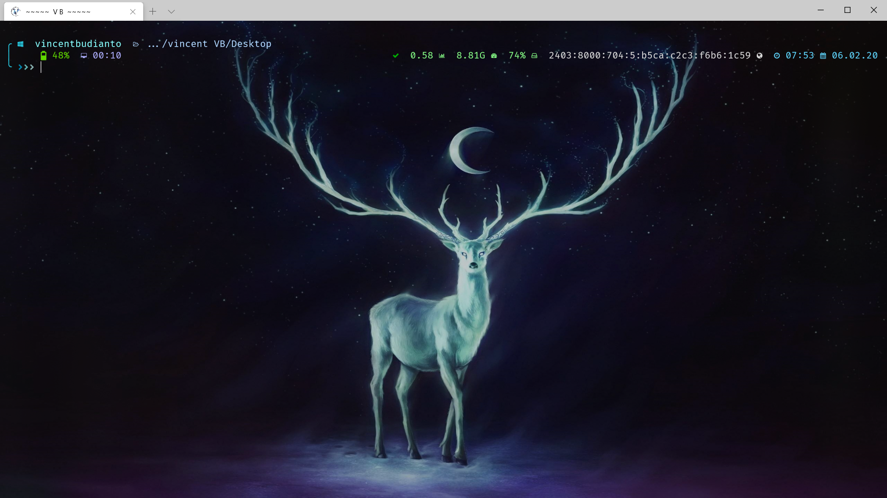
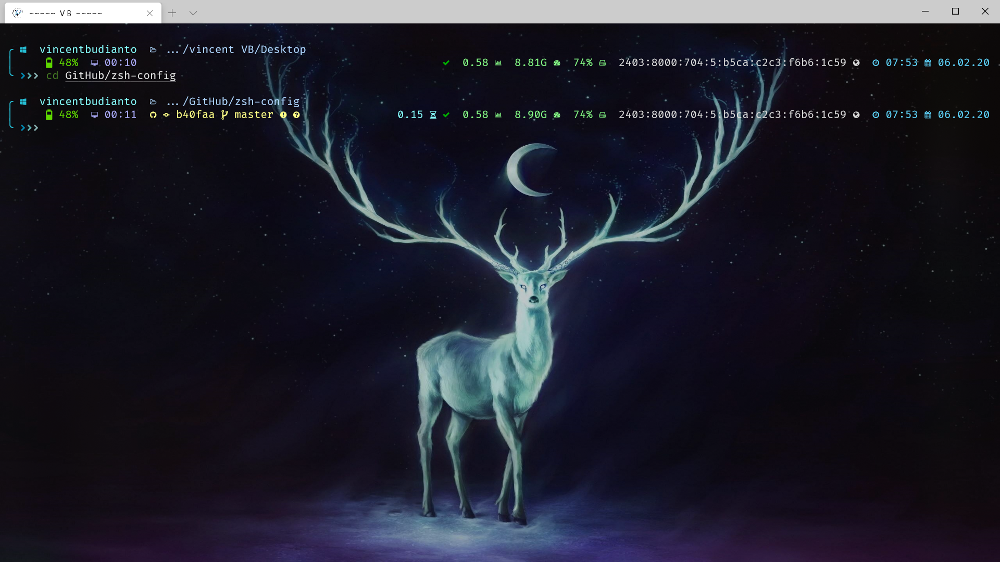
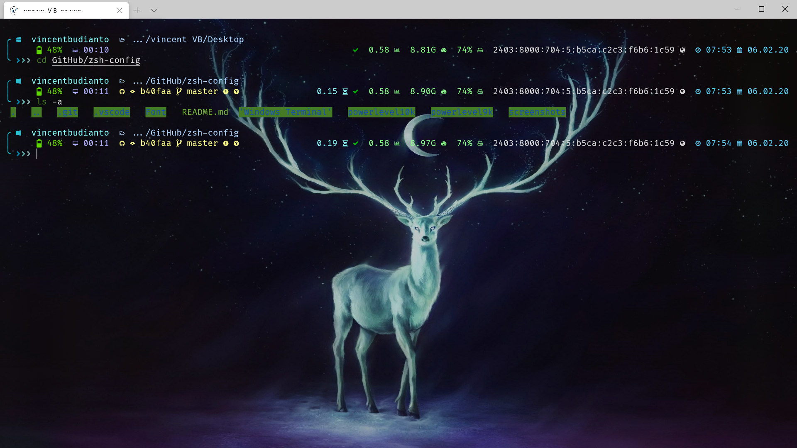
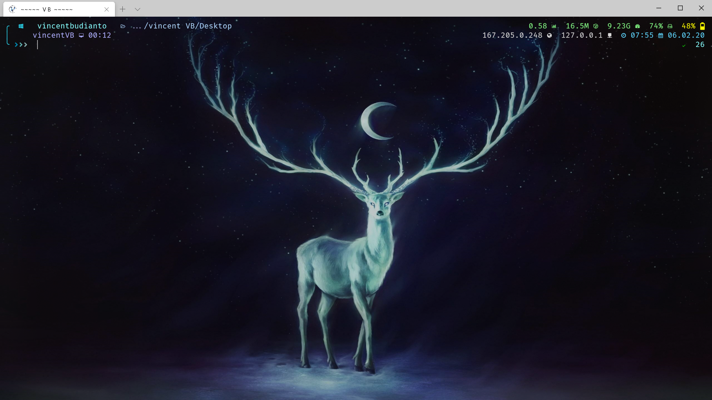
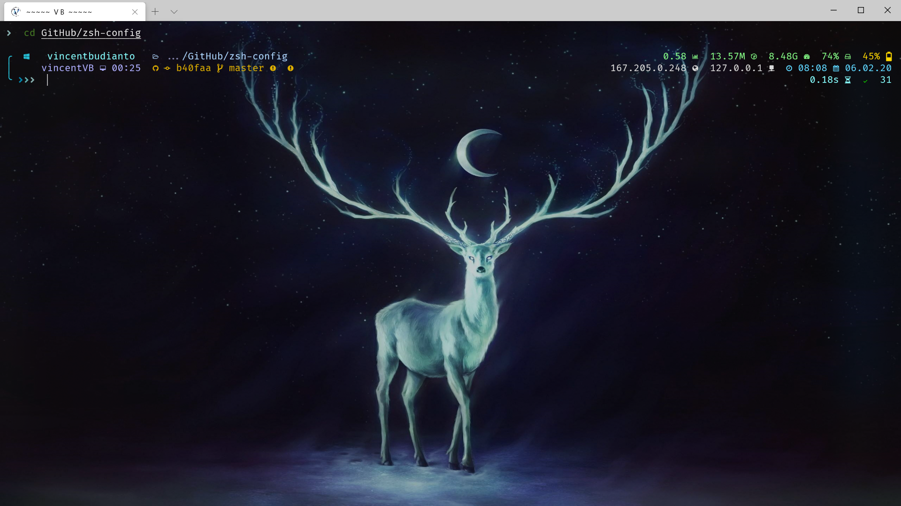
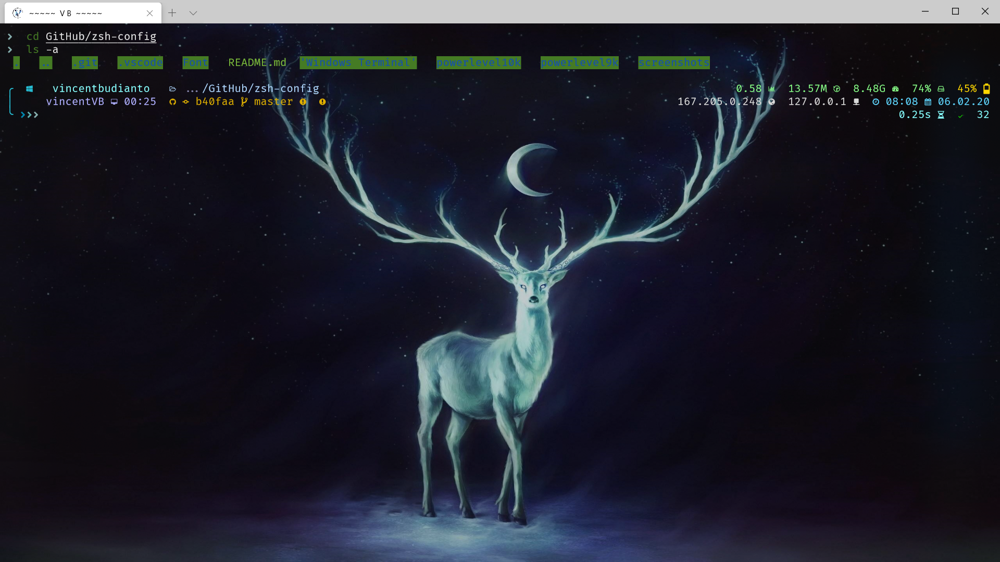

	<h3><b>UBUNTU WSL Windows Terminal ZSH-Config</b></h3>

A repo for storing my personal zsh config

**Requirements:**
* Windows Subsytem for Linux
* [Windows Terminal](https://github.com/microsoft/terminal)
* [Oh My Zsh](https://github.com/ohmyzsh/ohmyzsh)
* [Powerlevel9k](https://github.com/Powerlevel9k/powerlevel9k)
* [Powerlevel10k](https://github.com/romkatv/powerlevel10k)
* [Nerd Fonts](https://github.com/ryanoasis/nerd-fonts)

**powerlevel9k screenshots**

**powerlevel10k screenshots**

